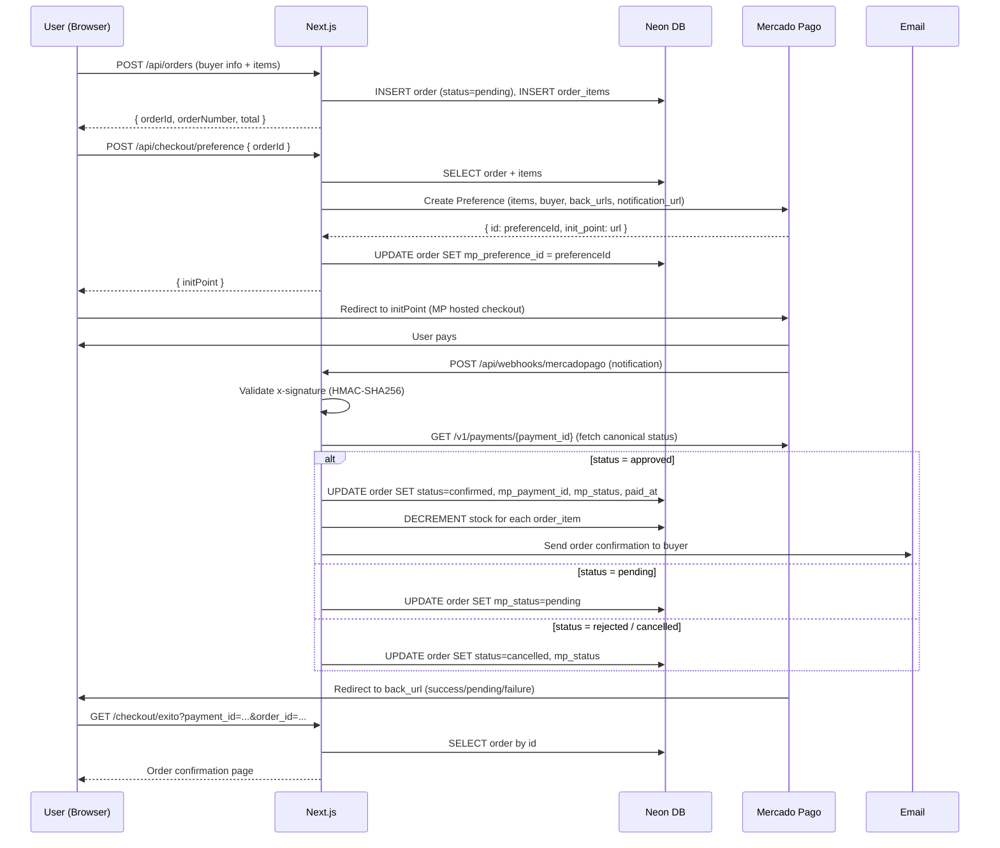

# MODO Coffee — Architecture Document

**Version:** 1.0
**Date:** 2026-04-09
**Status:** Approved for implementation

---

## Table of Contents

1. [Business Context](#1-business-context)
2. [Tech Stack Decisions](#2-tech-stack-decisions)
3. [Project Structure](#3-project-structure)
4. [Database Schema](#4-database-schema)
5. [API Routes Design](#5-api-routes-design)
6. [Page Routes and Layouts](#6-page-routes-and-layouts)
7. [Authentication Strategy](#7-authentication-strategy)
8. [Mercado Pago Integration Flow](#8-mercado-pago-integration-flow)
9. [Migration Plan](#9-migration-plan-static-html-to-nextjs)
10. [Component Architecture](#10-component-architecture)
11. [Deployment Strategy](#11-deployment-strategy)
12. [Architecture Decision Records (ADRs)](#12-architecture-decision-records)

---

## 1. Business Context

MODO Coffee is a Uruguayan specialty drip bag coffee brand. The platform needs to:

- Present the brand and product through a high-quality landing experience (already exists as static HTML)
- Sell drip bag coffees directly to consumers in Uruguay via Mercado Pago
- Allow internal team to manage products, orders, and view basic business metrics through an admin panel

**Out of scope for v1:**
- Subscription/recurring orders
- Multi-currency support (UYU only)
- Customer accounts / user registration
- International shipping
- Mobile app

---

## 2. Tech Stack Decisions

### Core Framework
| Layer | Choice | Reason |
|---|---|---|
| Framework | **Next.js 14 (App Router)** | Required. SSR/SSG for landing SEO, server actions and API routes for backend |
| Language | **TypeScript** | Type safety across frontend and backend in a single repo |
| Styling | **Tailwind CSS + CSS Modules** | Tailwind for admin/utility; CSS Modules for the landing page (preserves existing class-name conventions) |
| UI Components | **shadcn/ui** | Required for admin panel. Radix-based, accessible, unstyled by default |

### Database
**Choice: Neon (PostgreSQL, serverless)**

Neon is a serverless PostgreSQL provider with a native Vercel integration. It provides:
- Branching per PR (dev/staging environments at zero cost)
- Connection pooling via `@neondatabase/serverless` (critical for serverless functions — avoids connection exhaustion)
- Free tier covers MODO's v1 scale
- Standard PostgreSQL — no vendor lock-in on the query layer

**ORM: Drizzle ORM**
Lightweight, type-safe, generates SQL close to hand-written queries. Works seamlessly with Neon's serverless driver. Migrations are plain SQL files checked into the repo.

### Authentication
**Choice: NextAuth.js v5 (Auth.js)**
Admin-only authentication. Credentials provider (email + bcrypt password). JWT sessions stored as HTTP-only cookies. No OAuth needed for v1 — single admin user or small fixed team.

### State Management
**Choice: Zustand (cart) + React Server Components (catalog/products)**

- Cart: Zustand store with `localStorage` persistence via `persist` middleware. No server-side cart for v1 — guests checkout without accounts.
- Product/catalog data: fetched server-side via RSC, no client store needed.
- Admin state: React Query (`@tanstack/react-query`) for server state in admin panel (mutations, cache invalidation).

### Payments
**Choice: Mercado Pago Node.js SDK (`mercadopago`)**
Official SDK. Creates a `Preference` object server-side; redirects user to Mercado Pago hosted checkout. Webhooks handled by a dedicated API route.

### Email
**Choice: Resend**
Transactional email for order confirmation. Simple API, generous free tier, excellent Next.js/Vercel integration.

---

## 3. Project Structure

```
modo-coffee/
├── app/                          # Next.js App Router
│   ├── (marketing)/              # Route group — public landing
│   │   ├── layout.tsx            # Marketing layout (no admin chrome)
│   │   └── page.tsx              # Landing page (migrated from index.html)
│   ├── (shop)/                   # Route group — storefront
│   │   ├── layout.tsx            # Shop layout (nav + cart drawer)
│   │   ├── productos/
│   │   │   ├── page.tsx          # Product listing
│   │   │   └── [slug]/
│   │   │       └── page.tsx      # Product detail
│   │   ├── carrito/
│   │   │   └── page.tsx          # Cart review page
│   │   └── checkout/
│   │       ├── page.tsx          # Checkout form (name, email, address)
│   │       ├── exito/page.tsx    # Payment success
│   │       ├── pendiente/page.tsx
│   │       └── error/page.tsx
│   ├── (admin)/                  # Route group — admin panel
│   │   ├── layout.tsx            # Admin shell (sidebar + auth guard)
│   │   ├── admin/
│   │   │   ├── page.tsx          # Dashboard
│   │   │   ├── pedidos/
│   │   │   │   ├── page.tsx      # Order list
│   │   │   │   └── [id]/page.tsx # Order detail
│   │   │   └── productos/
│   │   │       ├── page.tsx      # Product list
│   │   │       ├── nuevo/page.tsx
│   │   │       └── [id]/page.tsx # Edit product
│   ├── api/
│   │   ├── auth/[...nextauth]/route.ts   # NextAuth handler
│   │   ├── products/
│   │   │   ├── route.ts          # GET (list), POST (create)
│   │   │   └── [id]/route.ts     # GET, PATCH, DELETE
│   │   ├── orders/
│   │   │   ├── route.ts          # GET (list — admin), POST (create)
│   │   │   └── [id]/
│   │   │       ├── route.ts      # GET, PATCH (status)
│   │   │       └── status/route.ts
│   │   ├── checkout/
│   │   │   └── preference/route.ts  # Create MP preference
│   │   └── webhooks/
│   │       └── mercadopago/route.ts # MP payment notifications
│   └── layout.tsx                # Root layout (fonts, metadata)
│
├── components/
│   ├── landing/                  # Landing page sections (RSC-safe)
│   │   ├── Navbar.tsx
│   │   ├── HeroSection.tsx
│   │   ├── HookSection.tsx
│   │   ├── ValuesSection.tsx
│   │   ├── ModesSection.tsx
│   │   ├── PackagingSection.tsx
│   │   ├── ProductJourney.tsx    # "use client" — scroll-driven
│   │   ├── HowItWorks.tsx        # "use client" — scroll-driven
│   │   ├── ManifestoSection.tsx
│   │   ├── ConceptSection.tsx
│   │   ├── ContactSection.tsx
│   │   └── Footer.tsx
│   ├── shop/
│   │   ├── ProductCard.tsx
│   │   ├── ProductGrid.tsx
│   │   ├── ProductFilters.tsx
│   │   ├── AddToCartButton.tsx   # "use client"
│   │   ├── CartDrawer.tsx        # "use client"
│   │   ├── CartItem.tsx
│   │   └── CheckoutForm.tsx      # "use client"
│   ├── admin/
│   │   ├── AdminSidebar.tsx
│   │   ├── DashboardMetrics.tsx
│   │   ├── OrdersTable.tsx
│   │   ├── OrderStatusBadge.tsx
│   │   ├── ProductsTable.tsx
│   │   └── ProductForm.tsx
│   └── ui/                       # shadcn/ui generated components
│
├── lib/
│   ├── db/
│   │   ├── index.ts              # Neon client + Drizzle instance
│   │   └── schema.ts             # Drizzle schema definitions
│   ├── auth.ts                   # NextAuth config
│   ├── mercadopago.ts            # MP SDK initialization
│   ├── email.ts                  # Resend client
│   ├── validations.ts            # Zod schemas for API inputs
│   └── utils.ts                  # Shared utilities (formatPrice, etc.)
│
├── store/
│   └── cart.ts                   # Zustand cart store with localStorage persist
│
├── hooks/
│   ├── useCart.ts
│   └── useScrollAnimation.ts     # Port of scroll JS logic to React hooks
│
├── migrations/                   # Drizzle migration SQL files
│
├── public/
│   ├── images/
│   │   ├── logo-round.jpg
│   │   ├── logo-black.png
│   │   ├── packaging.jpg
│   │   └── brand-concept.png
│   └── fonts/                    # Inter subset if self-hosted
│
├── styles/
│   ├── globals.css               # CSS variables, Tailwind directives
│   └── landing.module.css        # Direct port of styles.css (scoped)
│
├── drizzle.config.ts
├── next.config.ts
├── tailwind.config.ts
├── middleware.ts                 # Auth middleware (admin route protection)
└── .env.local                    # Never committed
```

---

## 4. Database Schema

### Entity Relationship Overview

```
products ─────< order_items >───── orders
                                      │
                                   (buyer info inline — no user table in v1)
```

### Schema (Drizzle ORM — `lib/db/schema.ts`)

```typescript
// products
export const products = pgTable('products', {
  id:           uuid('id').primaryKey().defaultRandom(),
  slug:         text('slug').notNull().unique(),
  name:         text('name').notNull(),
  description:  text('description'),
  origin:       text('origin').notNull(),           // e.g. "Etiopía"
  roastLevel:   text('roast_level').notNull(),      // 'light' | 'medium' | 'dark'
  flavorNotes:  text('flavor_notes').array(),       // ['frutal', 'floral', 'cítrico']
  weightGrams:  integer('weight_grams').notNull(),  // e.g. 100
  priceUyu:     numeric('price_uyu', { precision: 10, scale: 2 }).notNull(),
  stock:        integer('stock').notNull().default(0),
  images:       text('images').array(),             // public URLs (Vercel Blob or Cloudinary)
  isActive:     boolean('is_active').notNull().default(true),
  createdAt:    timestamp('created_at').defaultNow(),
  updatedAt:    timestamp('updated_at').defaultNow(),
});

// orders
export const orders = pgTable('orders', {
  id:              uuid('id').primaryKey().defaultRandom(),
  orderNumber:     text('order_number').notNull().unique(),  // "MODO-0001"
  status:          text('status').notNull().default('pending'),
                   // 'pending' | 'confirmed' | 'shipped' | 'delivered' | 'cancelled'
  // Buyer info (denormalized — no accounts in v1)
  buyerName:       text('buyer_name').notNull(),
  buyerEmail:      text('buyer_email').notNull(),
  buyerPhone:      text('buyer_phone'),
  // Shipping
  shippingAddress: text('shipping_address').notNull(),
  shippingCity:    text('shipping_city').notNull().default('Montevideo'),
  shippingNotes:   text('shipping_notes'),
  // Payment
  totalUyu:        numeric('total_uyu', { precision: 10, scale: 2 }).notNull(),
  mpPaymentId:     text('mp_payment_id'),        // Mercado Pago payment ID
  mpPreferenceId:  text('mp_preference_id'),     // MP preference used to init checkout
  mpStatus:        text('mp_status'),             // MP raw status: 'approved' | 'pending' | 'rejected'
  paidAt:          timestamp('paid_at'),
  createdAt:       timestamp('created_at').defaultNow(),
  updatedAt:       timestamp('updated_at').defaultNow(),
});

// order_items
export const orderItems = pgTable('order_items', {
  id:           uuid('id').primaryKey().defaultRandom(),
  orderId:      uuid('order_id').notNull().references(() => orders.id),
  productId:    uuid('product_id').notNull().references(() => products.id),
  productName:  text('product_name').notNull(),   // snapshot at order time
  priceUyu:     numeric('price_uyu', { precision: 10, scale: 2 }).notNull(),
  quantity:     integer('quantity').notNull(),
});

// admin_users
export const adminUsers = pgTable('admin_users', {
  id:           uuid('id').primaryKey().defaultRandom(),
  email:        text('email').notNull().unique(),
  passwordHash: text('password_hash').notNull(),
  name:         text('name'),
  createdAt:    timestamp('created_at').defaultNow(),
});
```

### Notes on Data Model Decisions

- **No customer accounts in v1.** Buyer info is stored inline in `orders`. Order lookup is by `orderNumber` + email if needed.
- **Flavor notes and images are PostgreSQL arrays.** Simple, avoids a join table for what is essentially a list of strings.
- **`order_items.product_name` and `price_uyu` are snapshots.** This ensures historical orders remain accurate if a product is later renamed or repriced.
- **Money stored as `NUMERIC(10,2)`.** Never float. All business logic and display use `toFixed(2)`.
- **Stock is decremented on `mpStatus = 'approved'` webhook**, not on order creation. Pending orders do not reserve stock in v1.

---

## 5. API Routes Design

All routes under `app/api/`. Public routes are unauthenticated. Admin routes require a valid session cookie (enforced by `middleware.ts`).

### Products

| Method | Route | Auth | Description |
|---|---|---|---|
| `GET` | `/api/products` | Public | List active products. Query params: `origin`, `roastLevel`, `page`, `limit` |
| `GET` | `/api/products/[id]` | Public | Single product by ID or slug |
| `POST` | `/api/products` | Admin | Create product |
| `PATCH` | `/api/products/[id]` | Admin | Update product fields |
| `DELETE` | `/api/products/[id]` | Admin | Soft-delete (sets `is_active = false`) |

**GET /api/products — Response:**
```json
{
  "products": [
    {
      "id": "uuid",
      "slug": "etiopia-yirgacheffe",
      "name": "Etiopía Yirgacheffe",
      "origin": "Etiopía",
      "roastLevel": "light",
      "flavorNotes": ["frutal", "floral", "bergamota"],
      "weightGrams": 100,
      "priceUyu": "420.00",
      "stock": 48,
      "images": ["https://..."],
      "isActive": true
    }
  ],
  "total": 12,
  "page": 1,
  "limit": 12
}
```

### Orders

| Method | Route | Auth | Description |
|---|---|---|---|
| `POST` | `/api/orders` | Public | Create order (called from checkout, before MP redirect) |
| `GET` | `/api/orders` | Admin | List orders with filters: `status`, `page`, `limit` |
| `GET` | `/api/orders/[id]` | Admin | Order detail with items |
| `PATCH` | `/api/orders/[id]/status` | Admin | Update order status |

**POST /api/orders — Request Body:**
```json
{
  "buyerName": "Juan García",
  "buyerEmail": "juan@example.com",
  "buyerPhone": "+598 99 000 000",
  "shippingAddress": "Av. 18 de Julio 1234, Apto 5",
  "shippingCity": "Montevideo",
  "shippingNotes": "Timbre roto, llamar al llegar",
  "items": [
    { "productId": "uuid", "quantity": 2 }
  ]
}
```

**POST /api/orders — Response:**
```json
{
  "orderId": "uuid",
  "orderNumber": "MODO-0042",
  "totalUyu": "840.00"
}
```

### Checkout / Mercado Pago

| Method | Route | Auth | Description |
|---|---|---|---|
| `POST` | `/api/checkout/preference` | Public | Create MP Preference, return `init_point` URL |
| `POST` | `/api/webhooks/mercadopago` | Public (validated) | Receive MP payment notifications |

**POST /api/checkout/preference — Request:**
```json
{ "orderId": "uuid" }
```

**POST /api/checkout/preference — Response:**
```json
{
  "initPoint": "https://www.mercadopago.com.uy/checkout/v1/redirect?pref_id=...",
  "preferenceId": "..."
}
```

### Webhook Validation

MP webhooks are validated by checking the `x-signature` header using HMAC-SHA256 with `MP_WEBHOOK_SECRET`. Invalid signatures return `401`. Valid notifications query the MP Payments API to get the canonical payment status before updating the database.

---

## 6. Page Routes and Layouts

```
/                               → Landing page (marketing layout)
/productos                      → Product catalog (shop layout)
/productos/[slug]               → Product detail (shop layout)
/carrito                        → Cart review (shop layout)
/checkout                       → Checkout form (shop layout, minimal nav)
/checkout/exito?payment_id=...  → Payment success
/checkout/pendiente             → Payment pending
/checkout/error                 → Payment failed / cancelled

/admin                          → Dashboard (admin layout, auth-gated)
/admin/pedidos                  → Order list
/admin/pedidos/[id]             → Order detail
/admin/productos                → Product list
/admin/productos/nuevo          → Create product
/admin/productos/[id]           → Edit product

/api/auth/signin                → NextAuth sign-in page (custom)
```

### Layout Hierarchy

```
app/layout.tsx                  (root — fonts, global metadata)
├── (marketing)/layout.tsx      (no chrome — transparent nav over hero)
├── (shop)/layout.tsx           (nav with cart icon, cart drawer, footer)
└── (admin)/layout.tsx          (sidebar, topbar, auth guard via middleware)
```

The marketing and shop routes share the same nav component but with different configurations. The admin layout is entirely separate — shadcn/ui components, no brand CSS.

---

## 7. Authentication Strategy

### Scope

Authentication is **admin-only**. Public users (shoppers) have no accounts.

### Implementation: NextAuth.js v5

```typescript
// lib/auth.ts
export const { handlers, auth, signIn, signOut } = NextAuth({
  adapter: DrizzleAdapter(db),  // or JWT-only (no DB sessions)
  providers: [
    Credentials({
      async authorize({ email, password }) {
        const user = await db.query.adminUsers.findFirst({
          where: eq(adminUsers.email, email)
        });
        if (!user) return null;
        const valid = await bcrypt.compare(password, user.passwordHash);
        return valid ? { id: user.id, email: user.email, name: user.name } : null;
      }
    })
  ],
  session: { strategy: 'jwt' },
  pages: { signIn: '/admin/login' }
});
```

### Route Protection: `middleware.ts`

```typescript
export default auth((req) => {
  const isAdminRoute = req.nextUrl.pathname.startsWith('/admin');
  const isApiAdminRoute = req.nextUrl.pathname.startsWith('/api/orders')
    || req.nextUrl.pathname.startsWith('/api/products');

  if ((isAdminRoute || isApiAdminRoute) && !req.auth) {
    return Response.redirect(new URL('/admin/login', req.url));
  }
});
```

### Admin User Bootstrap

Admin users are seeded via a one-time script (`scripts/seed-admin.ts`). No self-registration. Password hashed with `bcrypt` (12 rounds).

---

## 8. Mercado Pago Integration Flow

### Flow Diagram



### Mercado Pago Preference Structure

```typescript
const preference = {
  items: order.items.map(item => ({
    id: item.productId,
    title: item.productName,
    quantity: item.quantity,
    unit_price: Number(item.priceUyu),
    currency_id: 'UYU',
  })),
  payer: {
    name: order.buyerName,
    email: order.buyerEmail,
  },
  back_urls: {
    success: `${BASE_URL}/checkout/exito?order_id=${order.id}`,
    failure: `${BASE_URL}/checkout/error?order_id=${order.id}`,
    pending: `${BASE_URL}/checkout/pendiente?order_id=${order.id}`,
  },
  auto_return: 'approved',
  notification_url: `${BASE_URL}/api/webhooks/mercadopago`,
  external_reference: order.id,  // ties MP payment back to our order
  statement_descriptor: 'MODO COFFEE',
};
```

### Environment Variables

```bash
MP_ACCESS_TOKEN=           # Mercado Pago production access token
MP_PUBLIC_KEY=             # Used client-side if needed (v1: not needed)
MP_WEBHOOK_SECRET=         # HMAC secret for webhook signature validation
```

---

## 9. Migration Plan: Static HTML to Next.js

### Guiding Principle

The landing page is a creative asset — it has polished scroll-driven animations, custom SVG illustrations, and carefully tuned CSS. The migration preserves all visual fidelity. The strategy is **lift-and-adapt**, not rewrite.

### Phase 1: Next.js Scaffold (Day 1)

1. `npx create-next-app@latest modo-coffee --typescript --tailwind --app`
2. Copy `styles.css` to `styles/landing.module.css` (change global selectors to module-scoped where needed, or keep as a global import for landing only)
3. Copy `script.js` logic into `hooks/useScrollAnimation.ts` and `hooks/useParticles.ts`
4. Copy all images to `public/images/`
5. Set up Inter font via `next/font/google` instead of Google Fonts CDN link
6. Establish CSS variables in `styles/globals.css`

### Phase 2: Landing Page Migration (Days 2–3)

Each section in `index.html` becomes a React component under `components/landing/`:

| HTML Section | Component | Render Mode |
|---|---|---|
| `<nav>` | `Navbar.tsx` | Server (static content) + `"use client"` for scroll state |
| `#hero` | `HeroSection.tsx` | Server + client for particles |
| `#hook` | `HookSection.tsx` | Server |
| `#values` | `ValuesSection.tsx` | Server |
| `#modos` | `ModesSection.tsx` | Server |
| `#packaging-hero` | `PackagingSection.tsx` | Server |
| `#product-journey` | `ProductJourney.tsx` | Client (scroll-driven) |
| `#como` | `HowItWorks.tsx` | Client (scroll-driven) |
| `#manifesto` | `ManifestoSection.tsx` | Server |
| `#concepto` | `ConceptSection.tsx` | Server |
| `#contacto` | `ContactSection.tsx` | Server |
| `<footer>` | `Footer.tsx` | Server |

The `IntersectionObserver` reveal logic is extracted into a `useReveal` hook. The scroll-driven stage logic for `#product-journey` and `#como` is extracted into `useScrollStage(sectionRef, stageCount)`.

### Phase 3: Shop Features (Week 2)

1. Product catalog page + product detail pages
2. Zustand cart store + cart drawer component
3. Checkout form
4. MP integration (preference creation + back_url pages)

### Phase 4: Backend (Week 2–3, parallel to Phase 3)

1. Neon database setup + Drizzle schema + first migration
2. Product API routes (seeded with initial MODO products)
3. Order creation API
4. MP preference API + webhook handler

### Phase 5: Admin Panel (Week 3–4)

1. NextAuth setup + admin login page
2. Admin layout + sidebar (shadcn/ui)
3. Orders table + status update
4. Product CRUD + image upload
5. Dashboard metrics (order count, revenue, top products)

### Phase 6: Deploy (End of Week 4)

1. Vercel project setup + env vars
2. Neon production database branch
3. Domain configuration
4. MP production credentials
5. Smoke test full checkout flow

---

## 10. Component Architecture

### Rendering Strategy

```
Server Components (default)
├── All landing sections (static content, no interactivity)
├── Product listing (data fetch at request time)
├── Product detail (static at build time via generateStaticParams)
├── Admin pages (data fetched server-side per request)
└── All layouts

Client Components ("use client" boundary)
├── Navbar (scroll state)
├── ProductJourney (scroll position tracking)
├── HowItWorks (scroll position tracking)
├── HeroSection (floating particles — random values)
├── AddToCartButton (writes to Zustand store)
├── CartDrawer (reads Zustand store, slide-over animation)
├── CheckoutForm (controlled form, validation)
└── Admin forms (ProductForm, status update buttons)
```

### Landing vs. Admin Component Separation

Landing components live in `components/landing/` and use the CSS Module classes ported from `styles.css`. They have **zero dependency on shadcn/ui**.

Admin components live in `components/admin/` and are built entirely with shadcn/ui primitives (Table, Dialog, Badge, Card, etc.). They have **zero dependency on landing CSS**.

This ensures the brand styling is isolated and the admin panel is themeable independently.

### Cart Architecture

```
Zustand store (store/cart.ts)
├── state: CartItem[]  (id, slug, name, price, quantity, image)
├── actions: addItem, removeItem, updateQuantity, clearCart
└── middleware: persist → localStorage key 'modo-cart'

CartDrawer.tsx (Sheet component from shadcn/ui)
├── Reads store via useCart()
├── Renders CartItem list
└── "Ir al checkout" → navigates to /carrito

/carrito page
└── Reads store, shows summary, "Comprar" → POST /api/orders → redirect to MP
```

---

## 11. Deployment Strategy

### Infrastructure

```
Vercel (hosting + serverless functions)
└── Next.js app (all pages + API routes as Vercel Functions)
    └── Neon (PostgreSQL, serverless)
        └── Connection via @neondatabase/serverless (HTTP transport)
            └── No persistent connections — safe for serverless
```

### Environments

| Environment | Branch | Database | MP Credentials |
|---|---|---|---|
| Production | `main` | Neon `main` branch | Production access token |
| Preview | PR branches | Neon `preview/branch-name` | Sandbox (test) credentials |
| Local | `*` | Neon `dev` branch or local PG | Sandbox credentials |

Vercel's GitHub integration automatically creates preview deployments per PR, each with its own Neon branch (via Neon's Vercel integration).

### Image Storage

Product images are stored in **Vercel Blob** (native integration, no config needed). The admin panel product form uploads directly to Blob storage and stores the returned URL in the `images` array.

### Environment Variables (Vercel)

```bash
# Database
DATABASE_URL=              # Neon pooled connection string

# Auth
NEXTAUTH_SECRET=           # openssl rand -base64 32
NEXTAUTH_URL=              # https://modocoffee.com (prod)

# Mercado Pago
MP_ACCESS_TOKEN=
MP_WEBHOOK_SECRET=

# Email
RESEND_API_KEY=

# Blob
BLOB_READ_WRITE_TOKEN=     # Vercel Blob token

# App
NEXT_PUBLIC_BASE_URL=      # https://modocoffee.com
```

### Performance Targets

- Landing page: Lighthouse score ≥ 90 (Performance, Accessibility)
- Product listing: ISR with 60-second revalidation (catalog changes infrequently)
- Product detail: `generateStaticParams` for all active products, revalidate on product update
- Admin pages: no caching (always fresh data)

---

## 12. Architecture Decision Records

### ADR-001: Neon (serverless PostgreSQL) over PlanetScale or Supabase

**Contexto:** Need a managed database compatible with Vercel serverless functions. Vercel Functions have no persistent TCP connections.

**Opciones consideradas:**

| Option | Pros | Cons |
|---|---|---|
| Neon | HTTP transport driver, PR branching, native Vercel integration, standard PG | Relatively newer service |
| Supabase | Mature, includes auth/storage | Supabase auth conflicts with NextAuth; overkill for v1 scope |
| PlanetScale | MySQL-based, solid Vercel integration | Not PostgreSQL; Drizzle works better with PG; MySQL branching recently became paid |

**Decisión:** Neon
**Razones:** Standard PostgreSQL means zero vendor lock-in on the query layer. The `@neondatabase/serverless` driver uses HTTP transport, which is idiomatic for Vercel Functions. PR branching is a significant DX advantage.
**Consecuencias:** Slightly newer ecosystem. If Neon has downtime, the shop is unavailable. Mitigation: Neon has a generous SLA and free tier includes daily backups.

---

### ADR-002: Drizzle ORM over Prisma

**Contexto:** Need type-safe database access without the overhead or cold-start penalty of Prisma.

**Opciones consideradas:**

| Option | Pros | Cons |
|---|---|---|
| Drizzle | Lightweight, no Prisma engine binary, great Neon support, SQL-close queries | Smaller ecosystem than Prisma |
| Prisma | Largest ORM ecosystem, excellent DX | Prisma engine binary increases bundle size; known cold-start latency in serverless |
| Raw SQL (pg) | Maximum control | No type safety; more boilerplate |

**Decisión:** Drizzle
**Razones:** Serverless cold-start performance is critical for a storefront. Prisma's engine binary is a known issue. Drizzle's query builder is type-safe and generates predictable SQL. Schema-first approach with `drizzle-kit` migrations fits the team's workflow.
**Consecuencias:** Smaller community. Complex queries require more manual SQL than Prisma's fluent API. Acceptable trade-off for v1 data model.

---

### ADR-003: Zustand (localStorage) for cart over server-side cart

**Contexto:** Shoppers have no accounts. Cart needs to persist across page navigations and browser refreshes.

**Opciones consideradas:**

| Option | Pros | Cons |
|---|---|---|
| Zustand + localStorage | Zero backend calls for cart ops; instant UX; simple | Cart lost if user switches device or browser; no abandoned cart recovery |
| Server cart (session-based) | Persists across devices; enables abandoned cart emails | Requires session management without accounts; adds latency to all cart operations |
| Cookies | Works without JS storage | Size limits; sent on every request |

**Decisión:** Zustand + localStorage
**Razones:** v1 has no customer accounts and no abandoned cart feature. Server cart adds significant complexity with no user benefit at this stage. If subscriptions or accounts are added in v2, the cart can be migrated server-side at that point.
**Consecuencias:** Cart is lost on device switch. No abandoned cart emails. Both are explicit out-of-scope items for v1.

---

### ADR-004: Mercado Pago hosted checkout over custom payment form

**Contexto:** Mercado Pago offers two integration modes: hosted checkout (redirect to MP) or custom card form (embedded on site).

**Opciones consideradas:**

| Option | Pros | Cons |
|---|---|---|
| Hosted checkout (Preference) | Zero PCI scope; MP handles fraud/3DS; fastest to implement | User leaves the site; less brand control |
| Custom card form (Bricks/SDK) | Stays on site; more brand control | PCI compliance scope; more complex implementation; 3DS handling required |

**Decisión:** Hosted checkout (Preference API)
**Razones:** PCI compliance is a non-trivial burden. For a v1 Uruguay-focused DTC brand, the trust signal of a recognized MP checkout page is a feature, not a bug. Development speed is significantly better.
**Consecuencias:** Users are redirected to mercadopago.com.uy. Back_urls must be correctly configured and tested. If brand experience on checkout becomes a priority, migration to Bricks is straightforward — the order creation flow stays identical.

---

### ADR-005: CSS Modules for landing vs. Tailwind for admin

**Contexto:** The existing landing page has a highly specific, custom visual language (custom CSS variables, complex animations, SVG illustrations). The admin panel requires rapid UI assembly from standardized components.

**Opciones consideradas:**

| Option | Pros | Cons |
|---|---|---|
| CSS Modules for landing, Tailwind for admin | Perfect fidelity migration; no class naming conflicts | Two styling systems in one codebase |
| Pure Tailwind everywhere | Single styling system | Landing animations and specificity are painful in Tailwind; would require significant rewrite of visual logic |
| Styled Components / Emotion | Co-located styles | Runtime cost; not idiomatic with Next.js App Router RSC |

**Decisión:** CSS Modules for landing + Tailwind for admin/shop
**Razones:** The landing page CSS is a deliberate creative artifact. Porting it to Tailwind would introduce translation errors and slow down iteration on the brand design. CSS Modules provide scoping without runtime cost. Tailwind excels at the utility-heavy admin panel. The boundary is clean: `components/landing/` uses modules, `components/admin/` and `components/shop/` use Tailwind.
**Consecuencias:** Developers need to be aware of which directory they're working in. Shared primitives (buttons, inputs used in both shop and admin) should use Tailwind with variant props.

---

*Document prepared by: Architecture Review | MODO Coffee v1 Platform*
